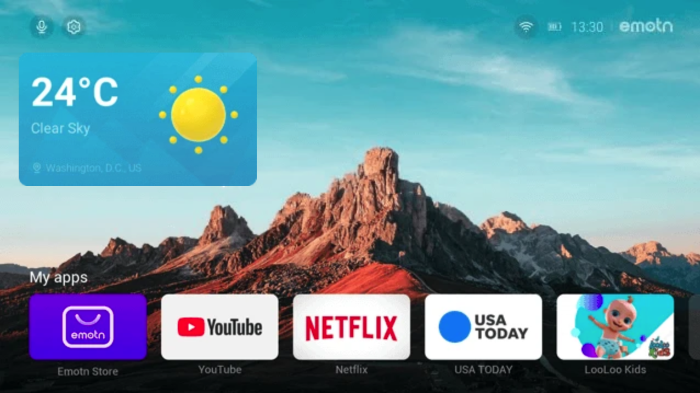
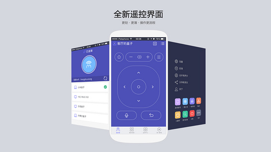
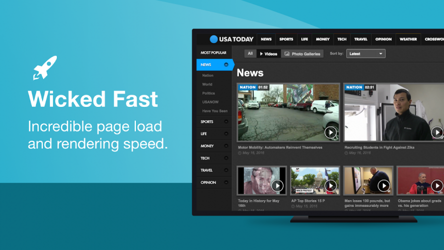
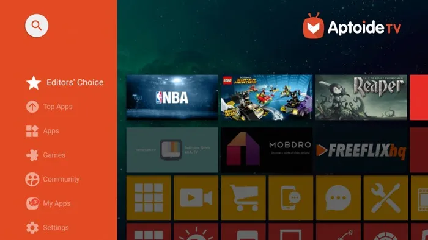
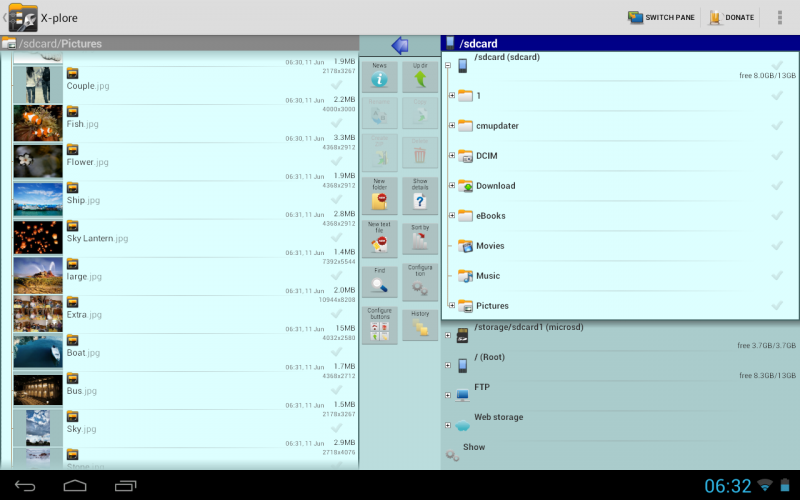
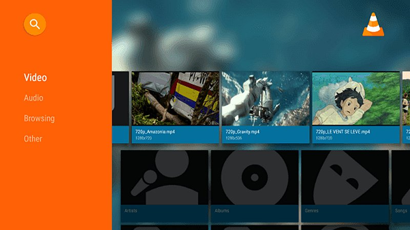

整理一些自己装机必备的软件，可以装在电视盒子或者投影仪里。主要是不要钱的、没广告的可以贪到小便宜的那种。

## 📺安卓TV桌面

1. **当贝桌面**

   不讲了，懂的都懂。会有广告，去znds.com找找修改过的版本。或者直接用下面这个

2. [**Emotn UI**](https://app.emotn.com/ui/)

   

   当贝桌面的海外版，相对当贝桌面来说功能多一点，是我正在使用的。

   	1. 首页小组件除了天气以外还多了一个内存管理。
   	1. 首页快捷启动app可以增加5个以上，当贝桌面固定5个。
   	1. 动态壁纸，壁纸中的景色会随现实中的时间变成白天的景色或者晚上的景色。
   	1. 没广告

## 🎞视频APP

1. 电视家

   什么能导入直播源的app都一边去吧，特别不稳定，整理也很艰难。在znds.com找个能直接用vip权限的电视家版本，没广告能看高清。

2. [Smart YouTube TV](https://smartyoutubetv.github.io/)

   

   其实看得比较多的还是YouTube，这款第三方YouTube软件跟原生软件基本没差，没有广告，功能全面。就是视频播放界面的设置操作有点乱。

## 🧩其他

1. [Clash for Android](https://github.com/Kr328/ClashForAndroid/releases)

   

   没什么好讲的。各机顶盒型号不尽相同，下载universal版本的基本上都能安装。进行初始配置的时候会需要用到鼠标。

2. [悟空遥控器](http://app.shafa.com/apk/wukongyaokongqi.html)

   

   没有鼠标或者没买飞鼠遥控的可以用一下。主要是可以直接传输手机上复制的内容，比较方便。

   不过需要开启一个在其他app上方显示的权限，实测坚果g9s投影仪这类把原生设置阉割很多的系统可能用不了。

3. [浏览器Puffin TV Browser for Android TV](https://puffin-tv.en.aptoide.com/app)

   

   有时候会用到浏览器传输东西，这个浏览器是专门为安卓电视系统设计的，遥控器就可以控制所有按钮，在网页内播放视频的时候视频控件也是适配遥控器的。

4. [应用商城Aptoide](https://en.aptoide.com/)

   

   收集了比较多的安卓tv软件，上述大部分软件都能直接在这里下载安装。

5. [X-plore File Manager](https://x-plore.en.aptoide.com/app)

   

   一个完全免费的全功能安卓TV文件管理器，ES浏览器一边去。

6. [VLC Media Player](http://www.videolan.org/vlc/download-android.html)

   

   一个完全免费开源的全平台视频播放器，功能非常强大，可以播放本地、串流、局域网的视频。我本地视频基本用Plex来架设服务器并观看，所以用的比较少。

先整理这些。投影仪、机顶盒这种设备，基本上还是会把自己常用的软件限制在那么几款里面，一开始新鲜劲一过，后面就没什么动力用遥控器来进行很繁琐的操控了。毕竟音影设备最重要的还是让人感受快乐。
