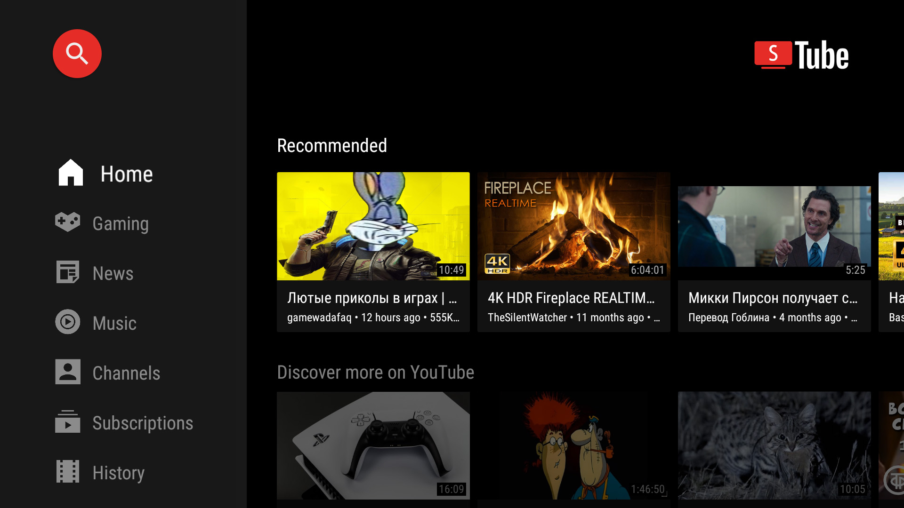
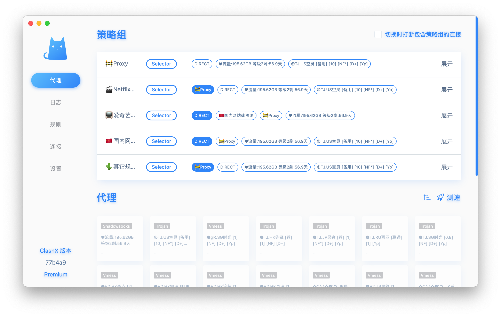
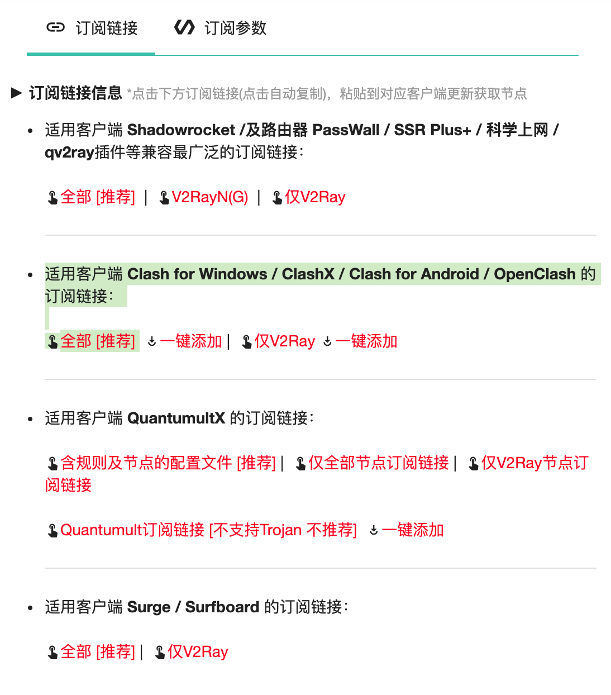
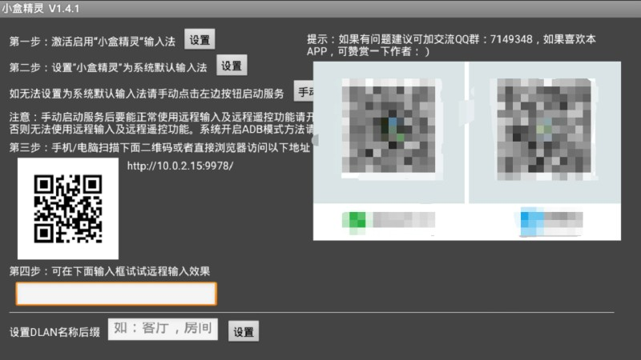
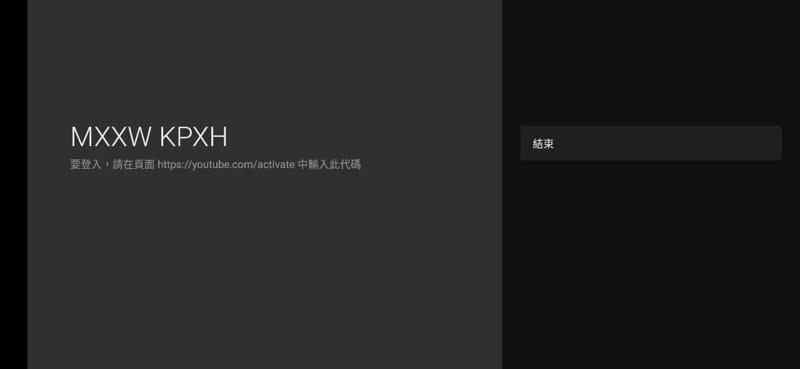

```
layout: post
title: 国产盒子如何观看YouTube
slug: guochanhezi-youtube
date: 2021-12-13 10:25:45
status: publish
author: Eddie
categories: 
  - 平替文章
tags:
  - 投影仪
  - 电视盒子
  - 国产
  - YouTube
excerpt: 低成本的通用观看YouTube方案。
```

估计稍微深入捣鼓过电视盒子或者投影仪的人都知道YouTube只能在google TV系统下才能正常使用。国产盒子、智能电视和投影仪比较难刷机、root，安装google service非常困难。

现在比较方便的解决方案是使用第三方开源YouTube客户端SmartTubeNext（原Smart YouTube TV），不仅无需安装Google Service环境，还去除了广告，推荐、点赞、订阅等功能都非常全面，与官方客户端无异。



下面介绍一下如何使用SmartTubeNext在电视上观看YouTube视频。

## 软件准备

SmartTubeNext虽然是第三方客户端，但本质还是调用的官方接口，国内依旧需要搭建特殊的网络环境来观看。

1. 下载SmartTubeNext

   [点击这里](https://smartyoutubetv.github.io/#releases-section)，再点击下载「Stable release」。

2. 下载Clash for Android

   Clash是一款可以在安卓上启用安全代理的软件，实测在TV上除了初始配置需要使用外接鼠标操作，日常使用时只需遥控器即可操作。

   [点击这里](https://github.com/Kr328/ClashForAndroid/releases)，再点击最新版本号下方的「Assets」，再选择「premium-universal-release.apk」版本下载。

3. 购买代理线路

   Clash只是链接代理的工具，实际代理服务还需要自己寻找服务商购买。

   > 这里推荐我一直在使用的代理服务商「召唤师」，效果稳定，速度快，观看YouTube 4K视频无压力。可选线路多，功能齐全。购买每月15元的双月卡就够用了。还送可观看Netflix、Hulu、Disney+的专线，非常好用。
   >
   > 
   >
   > [点击这里通过我的邀请链接注册](https://zhs.center/auth/register?code=43966i2AjGQX)，我可以获得2GB流量奖励，**你也可以获得5元余额和10GB的流量**。
   >
   > 购买时还可以叠加使用我的优惠码**获得9折优惠**：
   >
   > ```
   > 优惠码：9gHN9U43966
   > ```

4. 下载小盒精灵

   [点击这里下载](http://down.znds.com/apk/app/2020/0222/7414.html)。用于传输代理服务商生成的订阅链接到Clash。

## 安装步骤

1. 先将下载好的SmartTubeNext、Clash、小盒精灵通过U盘传输到机顶盒/智能电视/投影仪（以下统称大屏设备）上。

2. 在大屏设备上将三个软件全部安装。

3. 配置代理服务

   这里以召唤师的服务为例子。

   1. [点击链接](https://zhs.center/auth/register?code=43966i2AjGQX)注册召唤师账户；

   2. 点击左侧工具栏的「捐赠支持」，按照提示解锁捐赠、付款购买30个金币即可。

   3. 点击左侧工具栏的「召唤升级」，选择召唤「等级2双月卡」即可。

   4. 点击左侧工具栏的「用户中心」，拉到最下方「订阅链接」处，点击「适用客户端 **Clash**」下方的「全部[推荐]」既可复制订阅链接。

      

   5. 在大屏设备上打开小盒精灵，按屏幕提示将小盒精灵设为系统默认的输入法。

      

   6. 保证大屏设备与你的手机或电脑在同一WiFi网络下，然后扫描屏幕上的二维码或输入ip地址，进入遥控页面，这样就可以把手机变成大屏设备的键盘了。

   7. 大屏设备打开Clash，点击「配置」，点击「新配置」，点击「从URL导入」

   8. 输入名称（随意），通过小盒精灵粘贴URL，再点击右上角的保存按钮即可。

   9. 保存后记得再次点击刚刚新增的配置，把配置名前面的小圆点变成实心的即可。

   10. 后退回到Clash首页，点击启动。启动时会弹窗询问是否允许建立链接，点击「一律允许」。

   11. 启动完成后，点击「代理」，在「Proxy」分组下选中一个节点，即可成功代理。

   12. 大屏设备打开SmartTubeNext，如能正常显示Google账号登陆代码，即说明可以正常浏览YouTube视频了，如果提示网络错误，回到上一步选择其他节点。

## 登陆你的Google账户

到此为止，你已经可以正常在大屏设备上浏览YouTube，但是如果想使用个性化推荐、点赞、订阅等功能，还需要把Google账户登陆上SmartTubeNext。

1. 点击侧边栏的「设置」，点击「账号」，在右侧选择「新增账户」

   

2. 此时屏幕会显示一串登陆代码，手机或电脑打开https://www.youtube.com/activate，输入屏幕上的登陆代码即可。

   